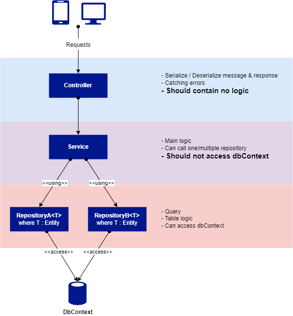

# Template Overview

## Architecture

#### 1. Service
- This is the place where we create APIs to be connected to the front end, whether it's for an admin panel, game, or webpage other than the admin panel. 
- This template already includes examples of how to use its Controller and Service (for more information please read: What It Can Do?) 
- Admin.Service and API.Service have their own Appsettings files. 

#### 2. Common
- This module only contains classes and libraries used by the Service. 
- The usage of third-party nugget packages and Core is located here. 
- The library invocation to use the database (MySQL or MongoDb) is provided here. 
- No AppSettings configuration is required. 

#### 3. Utils
- Mythic.Utils contains utilities used to assist in the development process. Currently there are functions for:
    - Authorization & Policies
    - Cloud Storage
    - Send Email
    - File Validation
        - Is Valid File Size
        - Is Valid File Extension
        - Is Valid Image Pixel Size
    - MD5 Hashing
    - Html to pdf
- Mythic.Health is used to check the liveliness and readiness of each API.
- Mythic.ServerToServer is used for communication between Mythic.Services, including the most important, which is connecting to Mythic.Account.Service.

#### 4. Core & Interface
- This module also contains classes and libraries. But unlike Common, this module has Core Modules for all templates.
- You are only allowed to use each module/library from this module.
- Because this is a core component of the template, it is not recommended to edit this module, except for something very urgent.
- Because we use Interface Pattern, so you only allowed to implements Interface from Mythic.Core.Interface.
- You are only allowed to implement the interface that exist in this module into Common.

## Repository Pattern

#### 1. Controllers
What Controllers should do :
- Serializing / Deserializing message & response from/to requesters
- Catching errors.  
Catching errors on this level of depts of request is help you to maintain the exception flow of the logic easy enough. You just need to throw the error from any layer as long as the top layer (Controllers) catch the error. 
- Using Services as its logic

**What you should NOT do in Controllers :**
- Place any logic in it (please use services instead)
- Using Repositories (since there is no logic, you should not use directly to repository)

#### 2. Services
What Services should do :
- Holds the main logic (Calculating, validating and etc)
- Using one or more repositories.
- Using another Services if needed. But **avoid using service that have same repository used** in it.
- Throwing errors/exception

**What you should NOT do in Services :**
- Access directly to DbContext

#### 3. Repositories
What Repositories should do :
- Holds table logic (Create, read, update, delete and etc)
- Can access dbContext
- Inherits BaseRepository from core modules
- Throwing errors/exception

**What you should NOT do in Repositories :**
- Place other logic but table logic (avoid using logic in repository, main logic should stored in service)
- Please avoid using another repository 

## There is template code to give us an example of:
- Standardized Controller and Service using CQRS pattern, as well as a Health Controller.
    - handling request
    - handling result for response
    - [TemplateCommandController](../src/movie-api/Controllers/Command/TemplateCommandController.cs)
- How to use EventSubscriber (using RabbitMQ)
    - [TemplateEventSubscriber.cs](../src/movie-api/Services/EventSubscribers/TemplateEventSubscriber.cs#35) and [TemplateEvent.cs](../src/movie-api/Events/TemplateEvent.cs)
- How to use Refit library
    - It is a library to create API Request to another service
    - [IGetDumEventRefitApi.cs](../src/movie-api/Services/Refit/IGetDumEventRefitApi.cs#13) and [TemplateQueryService.cs - SendToRefit()](../src/movie-api/Services/Query/Template/TemplateQueryService.cs#L235)
- How to user Polly library
    - This is a library to try API request every specified time
    - [TemplateQueryService.cs - SendToRefit()](../src/movie-api/Services/Query/Template/TemplateQueryService.cs#L235)
- How to use MethodTimer.Fody library
    - This is a library to know how long it takes to run a method
    - [TemplateQueryService.cs - Get()](../src/movie-api/Services/Query/Template/TemplateQueryService.cs#71)
- How to logging (info, warning, or error)
    - [TemplateQueryService.cs - Get()](../src/movie-api/Services/Query/Template/TemplateQueryService.cs#L71)
    - But you can see it in all service method
- How to do an API request to another server
    - [TemplateQueryService.cs - ServerToServer()](../src/movie-api/Services/Query/Template/TemplateQueryService.cs#L87)
- How to get Mythic Account data from Mythic.Account.Service
    - [TemplateQueryService.cs - GetMythicAccount()](/src/movie-api/Services/Query/Template/TemplateQueryService.cs#L119)
- How to use Fluent Validation
    - This is a library to automatically validate input from request dto
    - [TemplatePostRequestDto.cs](../src/movie-api/Dto/TemplatePostRequestDto.cs#L12)
    - [TemplateCommandService.cs](../src/movie-api/Services/Command/Template/TemplateCommandService.cs#L42)
    - Dont forget to add services scope in startup.cs
- How to use Fluent Assertion (Unit test) :
    - "A very extensive set of extension methods that allow you to more naturally specify the expected outcome of a TDD"
    - [TemplateServiceTest.cs](../test/movie-api-test/Services/TemplateServiceTests.cs#L46)
- How to use Auto Mapper :
    - This is a library to transform one object type to another
    - [MappingProfile.cs](../src/movie-api/Dto/MappingProfile.cs)
    - [TemplateQueryService.cs](../src/movie-api/Services/Query/Template/TemplateQueryService.cs#L82)
#### The startup file has been configured as follows:
- Setup authority
- Setup JWT
- Setup Redis
- Add RabbitMQ EventListener
- Add AutoMapper
- Add all required Service Singleton and Services Scope for the Core packages and Utils
