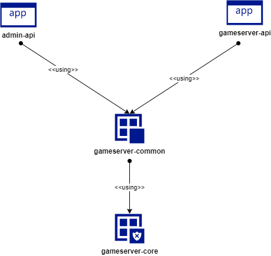
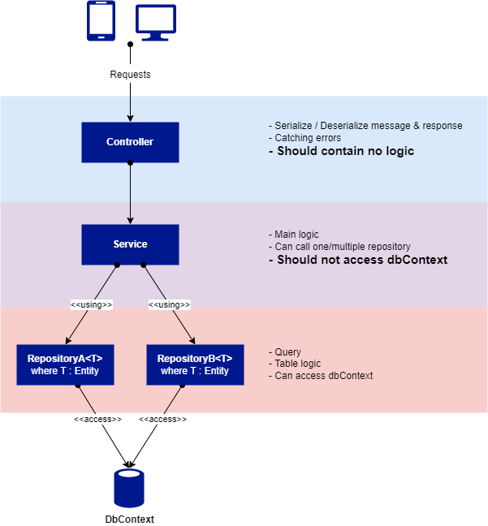

# Movie Overview

## Architecture

#### 1. Admin.Api
This project are responsible to handle request from admin panel. 
> Come with Admin User modules include **admin CRUD** and **admin login**.  
> Also come with Player Dummy modules. *(this can be your example reference of the project)*

#### 2. Game.Api
This project are responsible to handle request from Game Client. 
> There is no built-in service in this project.

#### 3. Game.Common
This project is only a class library. This holding components that are shared between `Admin.Api` and `Game.Api` project such as : 
- DbContext and Models 
- And other stuff like Controllers, Services, Repositories, Data, Enums and etc. If only this stuffs are used by both Admin.Api and Game.Api
- Appsettings. In this movie, Appsettings are centralized and shared between projects. So if you want separated appsettings just create new file `appsettings.json` in one or each project (Admin.Api and/or Game.Api)
> There are several built-in modules in this project. **You can freely edit or remove** thoose things if you need.

#### 4. Game.Core
This project is only a class library too. But unlike Game.Common, this project holds **core modules** of the whole movies.
What you can do to this project is **only to use its modules** in your project (Admin.Api, Game.Api and Game.Common)
> Since this project is the core components of the movie, **you should not freely edit or remove** something from this project, except for something really urgent. 
> You can only use its class by inherits the base class. Or, optionally, you can expand the class by using **partial class**

## Repository Pattern

#### 1. Controllers
What Controllers should do :
- Serializing / Deserializing message & response from/to requesters
- Catching errors.  
Catching errors on this level of depts of request is help you to maintain the exception flow of the logic easy enough. You just need to throw the error from any layer as long as the top layer (Controllers) catch the error. 
- Using Services as its logic

**What you should NOT do in Controllers :**
- Place any logic in it (please use services instead)
- Using Repositories (since there is no logic, you should not use directly to repository)

#### 2. Services
What Services should do :
- Holds the main logic (Calculating, validating and etc)
- Using one or more repositories.
- Using another Services if needed. But **avoid using service that have same repository used** in it.
- Throwing errors/exception

**What you should NOT do in Services :**
- Access directly to DbContext

#### 3. Repositories
What Repositories should do :
- Holds table logic (Create, read, update, delete and etc)
- Can access dbContext
- Inherits BaseRepository from core modules
- Throwing errors/exception

**What you should NOT do in Repositories :**
- Place other logic but table logic (avoid using logic in repository, main logic should stored in service)
- Please avoid using another repository 